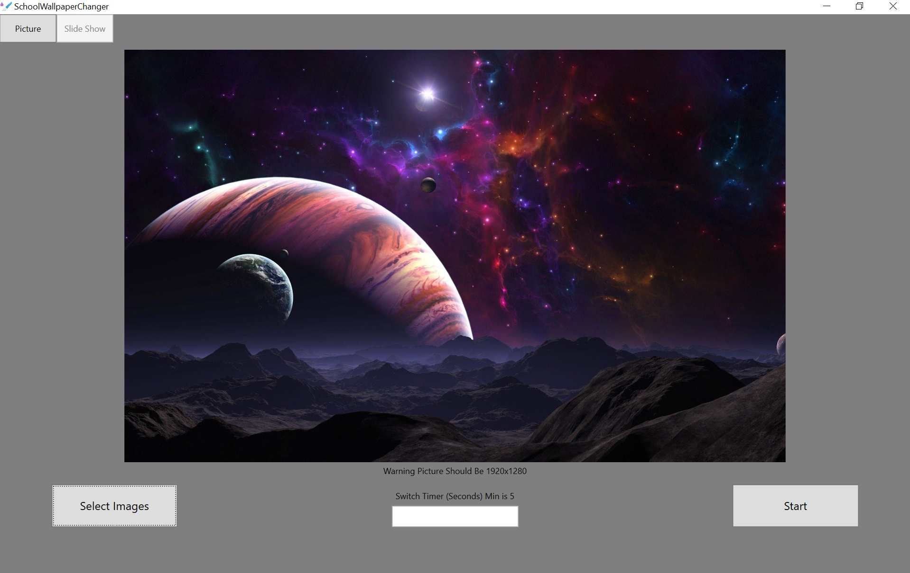

# School Wallpaper Changer

A .NET Framework 4.8, C# and WPF app which enables you to change the wallpaper of computer's with restricted permissions (computer's managed by organizations such as schools or businesses). Latest stable Release is Version `1.3.0`.

## Current Features 🛰

Adds a Slideshow or Static Wallpaper image to your computer's background:

## How to Contribute 🐱

Fork and clone the repository to your computer and open in Visual Studio 2022.

Submit a pull request to the dev branch following the PR template. 

### Planned Features for Future Releases 🚀

More features like a more professional UI, Much cleaner code and hopefully alot more ways to have your wallpaper set EX: Video, Link, GIF, and more. Also a decrease in ram and resource usage and more coming soon.

### Issues ⛔
If you experience any issues when running School Wallpaper Changer, report an Issue following the issues template.
